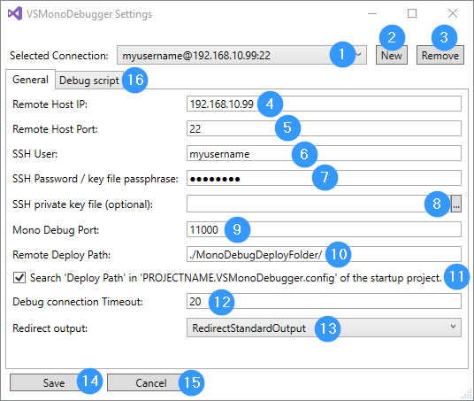
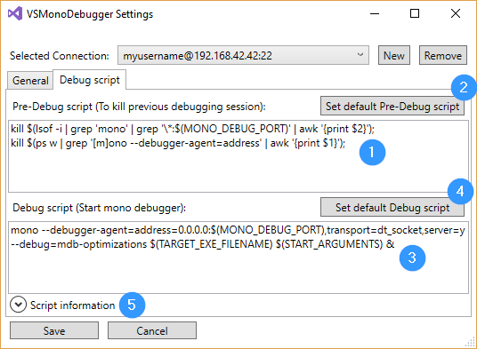

VSMonoDebugger
============

Enables Visual Studio 2017 to deploy and debug a .Net application on a remote Linux machine with mono installed over SSH.

# Usage

### Settings
You have to save a valid SSH connection first!

> Menu "Mono"/"Settings..."

- [1] Selects the connection to use for deploying and debugging
- [2] You can create a additional SSH connection
- [3] You can remove a SSH connection (The last connection can not be deleted)
- [4] Enter the remote SSH IP or host name
- [5] Enter the SSH port
- [6] Enter the SSH username
- [7] Enter the SSH password (if there is no password => leave the field empty)
- [8] Mono opens a debug session over this port
- [9] This is where the project output is deployed
- [10] Timeout to connect to the debug session
- [11] Console outputs can be output in the Visual Studio Output window
- [12] All changes are saved after you click on "Save"
- [13] All changes are discarded if you click on "Cancel"
- [14] Change the default debugging scripts on tab "Debug scripts". (ex.: to add sudo)

- [1] Change the Pre-Debug script to kill old mono debug sessions
- [2] The default Pre-Debug script is loaded if you click on "Set default Pre-Debug script" or the input is empty
- [3] Change the Debug script to start a mono debug session
- [4] The default Debug script is loaded if you click on "Set default Debug script" or the input is empty
- [5] For further script information click on "Script information"

- [1] Information about all supported parameters

### Deploy
You can deploy your "Startup project" output to the remote machine via SSH configured under "Settings".

> Menu "Mono"/"Deploy only (SSH)"

###### Notice
To speed up deployment, [SshFileSync](https://github.com/GordianDotNet/SshFileSync) is used.

> To upload only changed files, an additional cache file '.uploadCache.cache' is stored in the destination folder. 
> Don't delete this cache file! 

### Debug
You can start a debug session in Visual Studio 2017 on the remote machine.

> Menu "Mono"/"Debug only (SSH)"

### Deploy and Debug
You can run both commands in one step.

> Menu "Mono"/"Deploy and Debug (SSH)"

### Attach to mono debugger (without SSH)
You can debug a mono process that is already waiting for a debugger. SSH is not necessary. Only one TCP connection is required. The mono process must be started manually with the necessary arguments.

> Menu "Mono"/"Attach to mono debugger (without SSH)"

### Build Startup Project with MDB Files
You can build the startup project and all dependent projects. Additionally the mdb files are created. This is necessary for the support "Attach to mono debugger (without SSH)", because the mdb files must be present in every output directory of dependent projects.

> Menu "Mono"/"Build Startup Project with MDB Files"

# Known Issues

- [ ] Support prerequisite Microsoft.VisualStudio.Component.MonoDebugger without copying the dlls
- [ ] Support settings in an [Options Page](https://msdn.microsoft.com/en-us/library/bb166195.aspx)
- [ ] Not all project types are supported (startup project must be set)
- [ ] Code has to be refactored for better error logging
- [ ] Why can't the Mono.Cecil.Pdb.NativePdbReaderProvider type be found in Visual Studio to support pdb files?

# Solved Issues

- [x] Script to stop running mono debug process has dependencies (workaround depends on installed packages)
- [x] Support break points in referenced projects. *.mdb files are searched locally in each output directory, so we need mdb files in each project output directory (see Mono.Cecil.Cil.DefaultSymbolReaderProvider.GetSymbolReader()).

###### Suported since version 0.7.5 via "custom debug scripts"

# Version History

## 0.7.6
**2018-08-25**

- [x] Bugfix: Support break points in referenced projects. *.mdb files are searched locally in each output directory, so we need mdb files in each project output directory. 
- [x] Feature: Build only startup project instead of whole solution and show error window automatically
- [x] Feature: Add new menu item "Attach to mono debugger (without SSH)"
- [x] Feature: Add new menu item "Build Startup Project with MDB Files"

## 0.7.5
**2018-07-11**

- [x] Bugfix: NullReference in UserSettingsContainer fixed
- [x] Bugfix: Visual Studio 2017 doesn't include Newtonsoft.Json.dll anymore. See [newtonsoftjsondll-not-included-in-vsix](https://social.msdn.microsoft.com/Forums/sqlserver/en-US/550ddfdc-027c-41ba-9b32-31e6391bc038/newtonsoftjsondll-not-included-in-vsix?forum=vsx)
- [x] Bugfix: Load default UserSettings without username and password instead of NullReferenceException
- [x] Feature: Support custom debug scripts. (ex. to support sudo or additional preparations.)
- [x] Feature: Error logging and handling improved for StartDebuggerAsync if a script has syntax errors.

## 0.7.0
**2018-03-18**

- [x] Support fast deployment with [SshDeltaCopy](https://github.com/GordianDotNet/SshFileSync) 
- [x] Integrate the Xamarin Mono Debugger (Mono.Debugging.VisualStudio.4.9.10-pre)
- [x] Create mdb files before deployment with a integrated pdb2mdb function
- [x] Manage multiple ssh connections (deployment devices)
- [x] Show standard output in the Visual Studio Output window
- [x] Support embedded devices (Testet on a Raspberry 2 with Yocto Linux version 4.9.27 and Mono 5.4)

## 0.1.0
**2018-01-20**

- [x] Start project

# Used resources

- [x] [Visual Studio Image Library 2017](https://www.microsoft.com/en-my/download/details.aspx?id=35825)
- [x] [Mono.Debugging.VisualStudio.4.9.10-pre](Mono.Debugging.VisualStudio.4.9.10-pre/README.txt)
- [x] [pdb2mdb source code](https://github.com/mono/mono/tree/master/mcs/tools/pdb2mdb)
- [x] [Newtonsoft.Json.dll Version 10.0.3.21018](https://www.newtonsoft.com/json)