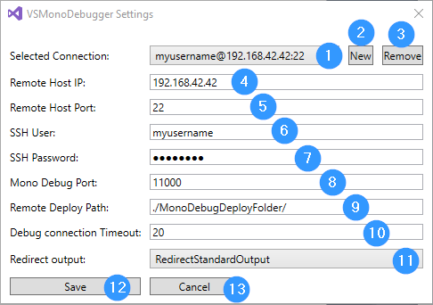

VSMonoDebugger
============

Enables Visual Studio 2017 to deploy and debug mono application on remote linux machines via SSH.

# Usage

### Settings
You have to save a valid SSH connection first!

> Menu "Mono"/"Settings..."

- [1] Selects the connection to use for deploying and debugging
- [2] You can create a additional SSH connection
- [3] You can remove a SSH connection (The last connection can not be deleted)
- [4] Enter the remote SSH IP or host name
- [5] Enter the SSH port
- [6] Enter the SSH username
- [7] Enter the SSH password (if there is no password => leave the field empty)
- [8] Mono opens a debug session over this port
- [9] This is where the project output is deployed
- [10] Timeout to connect to the debug session
- [11] Console outputs can be output in the Visual Studio Output window
- [12] All changes are saved after you click on "Save"
- [13] All changes are discarded if you click on "Cancel"

### Deploy
You can deploy your "Startup project" output to the remote machine via SSH configured under "Settings".

> Menu "Mono"/"Deploy only (SSH)"

###### Notice
To speed up deployment, [SshFileSync](https://github.com/GordianDotNet/SshFileSync) is used.

> To upload only changed files, an additional cache file '.uploadCache.cache' is stored in the destination folder. 
> Don't delete this cache file! 

### Debug
You can start a debug session in Visual Studio 2017 on the remote machine.

> Menu "Mono"/"Debug only (SSH)"

### Deploy and Debug
You can run both commands in one step.

> Menu "Mono"/"Deploy and Debug (SSH)"

# Known Issues

- [ ] Support prerequisite Microsoft.VisualStudio.Component.MonoDebugger without copying the dlls
- [ ] Support settings in an [Options Page](https://msdn.microsoft.com/en-us/library/bb166195.aspx)
- [ ] Script to stop running mono debug process has dependencies (workaround depends on installed packages)
- [ ] Not all project types are supported (startup project must be set)

# Version History

## 0.7.0
**2018-03-18**

- [x] Support fast deployment with [SshDeltaCopy](https://github.com/GordianDotNet/SshFileSync) 
- [x] Integrate the Xamarin Mono Debugger (Mono.Debugging.VisualStudio.4.9.10-pre)
- [x] Create mdb files before deployment with a integrated pdb2mdb function
- [x] Manage multiple ssh connections (deployment devices)
- [x] Show standard output in the Visual Studio Output window
- [x] Support embedded devices (Testet on a Raspberry 2 with Yocto Linux version 4.9.27 and Mono 5.4)

## 0.1.0
**2018-01-20**

- [x] Start project

# Used resources

- [x] [Visual Studio Image Library 2017](https://www.microsoft.com/en-my/download/details.aspx?id=35825)
- [x] [Mono.Debugging.VisualStudio.4.9.10-pre](Mono.Debugging.VisualStudio.4.9.10-pre/README.txt)
- [x] [pdb2mdb source code](https://github.com/mono/mono/tree/master/mcs/tools/pdb2mdb)