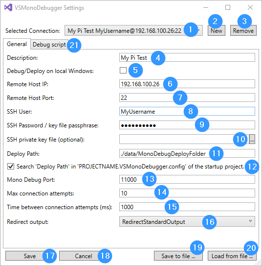
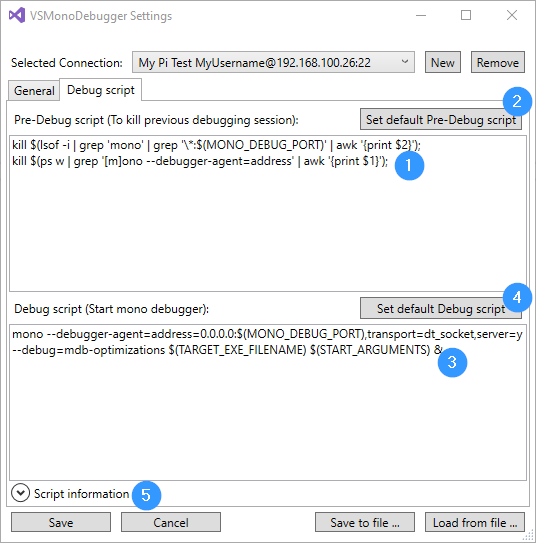
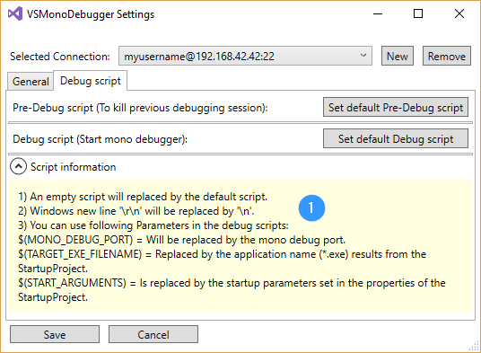
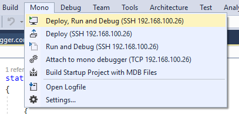
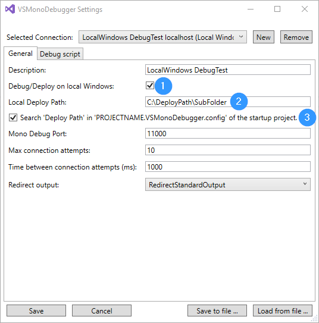
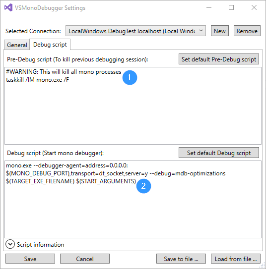

**Use at your own risk!**

VSMonoDebugger
============

Enables Visual Studio 2017 and 2019 to deploy and debug a .Net application on a remote Linux machine with mono installed over SSH.
Local debugging under Windows with Mono installed is now also supported.

**For bugs with the latest version, an older version can be found here:** [MarketplaceReleases](https://github.com/GordianDotNet/VSMonoDebugger/tree/master/MarketplaceReleases)

# Usage

## Visual Studio 2019 Support
In Visual Studio 2019, extension menus are handled differently. "Mono" can now be found in the "Extensions" menu.


## Settings (Linux over SSH)
You have to save a valid SSH connection first!

> Menu "Mono"/"Settings..."



- [1] Selects the connection to use for deploying and debugging
- [2] You can create a additional setting
- [3] You can remove a setting (The last connection can not be deleted)
- [4] Enter a description (Useful to distinguish different settings with the same IP.)
- [5] If disabled SSH remote (Linux) deployment is used. If enabled local (Windows) deployment is used.
- [6] Enter the remote SSH IP or host name
- [7] Enter the SSH port
- [8] Enter the SSH username
- [9] Enter the SSH password or private key file passphrase (if there is no password => leave the field empty)
- [10] Enter/set the filepath to a private key file (if there is no ssh private key authentication => leave the field empty)
- [11] This is where the project output is deployed
- [12] If enabled you can create a JSON config file to overwrite the 'Remote Deploy Path'. (see below)
- [13] Mono debugger tries to connect to the mono process via this port.
- [14] Connection attempts to a running / waiting mono process (useful for attach mode)
- [15] Time (ms) between two connection attempts
- [16] Console outputs can be output in the Visual Studio Output window
- [17] All changes are saved and dialog is closed if you click on "Save"
- [18] All changes are discarded and dialog is closed if you click on "Cancel"
- [19] Save all settings to a external json file via "Save to file ..."
- [20] Load all settings from a external json file via "Load from file ..."
- [21] Change the default debugging scripts on tab "Debug scripts". (ex.: to add sudo)


- [1] Change the Pre-Debug script to kill old mono debug sessions. Not necessary, if you make sure that all old mono debug process have been terminated.
- [2] The default Pre-Debug script is loaded if you click on "Set default Pre-Debug script"
- [3] Change the Debug script to start a mono debug session or a embedded mono application
- [4] The default Debug script is loaded if you click on "Set default Debug script"
- [5] For further script information click on "Script information"


- [1] Information about all supported parameters

## Debugging (Linux over SSH)


### Deploy
You can deploy your "Startup project" output to the remote machine via SSH configured under "Settings".

> Menu "Mono"/"Deploy only (SSH)"

###### Notice
To speed up deployment via SSH, [SshFileSync](https://github.com/GordianDotNet/SshFileSync) is used.

> To upload only changed files, an additional cache file '.uploadCache.cache' is stored in the destination folder. 
> Don't delete this cache file unless the deployment does not transfer all files.

### Debug
You can start a debug session in Visual Studio on the remote machine without deployment.
Three steps are executed
- [1] The Pre-Debug script is called on the remote host to terminate old mono debug processes
- [2] The Debug script is called on the remote host to start a new mono debug process
- [3] VSMonoDebugger tries to attach itself via the mono debug port using tcp

> Menu "Mono"/"Debug only (SSH)"

### Deploy and Debug
You can run both commands in one step.

> Menu "Mono"/"Deploy and Debug (SSH)"

## Settings (Windows local machine)

> Menu "Mono"/"Settings..."



- [5] If enabled local (Windows) deployment is used. If disabled SSH remote (Linux) deployment is used.
- [2] This is where the project output is deployed on the local windows machine.
- [3] If enabled you can create a JSON config file to overwrite the 'Remote Deploy Path'. (see below)



**Note: Scripts for Windows are running in a PowerShell environment!**
- [1] Change the Pre-Debug script to kill all mono processes. Not necessary, if you make sure that all old mono debug process have been terminated.
- [2] The default Pre-Debug script is loaded if you click on "Set default Pre-Debug script"
- [3] Change the Debug script to start a mono debug session or a embedded mono application
- [4] The default Debug script is loaded if you click on "Set default Debug script"
- [5] For further script information click on "Script information"

## Debugging (Windows local machine)


**Note: You have to install mono and include mono.exe to your PATH environment!**

### Deploy
You can deploy your "Startup project" output to the local Windows machine configured under "Settings".

> Menu "Mono"/"Deploy only (Local)"

### Debug
You can start a debug session in Visual Studio on the local machine without deployment.
Three steps are executed
- [1] The Pre-Debug script is called to terminate old mono debug processes (Currently all mono processes!)
- [2] The Debug script is called to start a new mono debug process
- [3] VSMonoDebugger tries to attach itself via the mono debug port using tcp

> Menu "Mono"/"Debug only (Local)"

### Deploy and Debug
You can run both commands in one step.

> Menu "Mono"/"Deploy and Debug (Local)"

## Debugging and Settings (Linux and Windows)

### Attach to mono debugger (without SSH)
You can debug a mono process that is already waiting for a debugger. SSH is not necessary. Only one TCP connection is required. The mono process must be started manually with the necessary arguments.
It is usefull if you have a embedded mono enviroment in a C++ application (see #5).

> Menu "Mono"/"Attach to mono debugger (TCP)"

### Build Startup Project with MDB Files
You can build the startup project and all dependent projects. Additionally the mdb files are created. This is necessary for the support "Attach to mono debugger (TCP)", because the mdb files must be present in every output directory of dependent projects.

> Menu "Mono"/"Build Startup Project with MDB Files"

### Overwrite the remote deploy path for a startup project
1) You have to enable the option via

> Menu "Mono"/"Settings..."/"Search 'Deploy Path' in 'PROJECTNAME.VSMonoDebugger.config' of the startup project."

2) You have to create a file with name 'PROJECTNAME.VSMonoDebugger.config' in the same directory like your startup project file (PROJECTNAME have to be the name of your project). 

ex.: 'MyNewSampleProject.csproj' results in 'MyNewSampleProject.VSMonoDebugger.config'

3) The file must contain a JSON object with the property "SSHDeployPath" ("WindowsDeployPath" for local Windows deployment):

```
{
	"SSHDeployPath": "./NewDeployPath/",
	"WindowsDeployPath": "C:\\DeployPath\\SecondSubFolder"
}
```
**WARNING: WindowsDeployPath has to be json string conform - you have to escape "\\" with "\\\\" characters!**

# Known Issues

- [ ] Support prerequisite Microsoft.VisualStudio.Component.MonoDebugger without copying the dlls (Makes problems with Xamarin's debugger)
**If you are using Xamarin and debugging fails, please disable VSMonoDebugger!**

- [ ] Support settings in an [Options Page](https://msdn.microsoft.com/en-us/library/bb166195.aspx)
- [ ] Code has to be refactored for better error logging
- [ ] Why can't the Mono.Cecil.Pdb.NativePdbReaderProvider type be found in Visual Studio to support pdb files?
- [ ] Sometimes errors (like collection was modified) are thrown and you have to restart the debugging process.

# Solved Issues

- [x] Script to stop running mono debug process has dependencies (workaround depends on installed packages)
- [x] Support break points in referenced projects. *.mdb files are searched locally in each output directory, so we need mdb files in each project output directory (see Mono.Cecil.Cil.DefaultSymbolReaderProvider.GetSymbolReader()).
- [x] Ignore unsupported project types (like C++, VB, F#)
- [x] Under Ubuntu replace the Pre-Debug script with `pkill -f mono` to kill old mono debug sessions.
And give your user root rights for `pkill` and `mono` [see: Run a specific program as root without a password promt](https://unix.stackexchange.com/questions/18830/how-to-run-a-specific-program-as-root-without-a-password-prompt)
```
# User alias specification
yourUserName ALL=(ALL) NOPASSWD: /usr/bin/pkill, /usr/bin/mono
```
- [x] Support [ssh private key authentication](https://www.digitalocean.com/community/tutorials/how-to-set-up-ssh-keys-on-ubuntu-1604) to authenticate
- [x] When using the ProvideAutoLoad attribute, your package (VSMonoDebugger.VSMonoDebuggerPackage) class should derive from AsyncPackage instead of Package to improve performance. Read more about using AsyncPackage here: https://aka.ms/asyncpackage.
**Visual Studio 2019 shows a warning**

# Version History

## 1.0.5
**2020-01-12**

- [x] Feature: Local Windows support for Deployment and Debugging added (scripts run in [PowerShell](https://docs.microsoft.com/en-us/dotnet/api/system.management.automation.runspaces.runspacefactory?view=pscore-6.2.0))
- [x] Feature: MaxConnectionAttempts and TimeBetweenConnectionAttemptsInMs support added (Debug connection timeout removed - didn't work)
- [x] Feature: Show IP in menu text
- [x] Feature: Support "Save as ..." and "Load from ..." for setting dialog
- [x] Change: Allow empty scripts (don't use default script)

## 0.9.5
**2019-10-09**

- [x] Bugfix: Set the parent window handle for the setting dialog
- [x] Bugfix: GitHub Security Warning: vulnerability found in SharpCompress < 0.24

## 0.9.3
**2019-06-20**

- [x] Bugfix: #11 Revert package reference update to support older version of visual studio 2017 (15.0.x)
- [x] Bugfix: Support Visual Studio 2019 16.x version numbers (before only 16.0)
- [x] Bugfix: #11 Program Output wasn't printed into output window anymore

## 0.9.0
**2019-06-03**

- [x] Feature: Switched to AsyncPackage to avoid warning in Visual Studio 2019
- [x] Feature: Supports a separate deployment path for each startup project via PROJECTNAME.VSMonoDebugger.config in the project folder
- [x] Bugfix: #7 Catch exception of unsupported setup projects .vdproj
- [x] Bugfix: #10 Allow only IPv4 for the result of Dns.GetHostAddresses - IPv6 is not supported by mono softdebugger

## 0.8.0
**2019-05-05**

- [x] Feature: Support Visual Studio 2019
- [x] Bugfix: Include System.Diagnostics.Tracer.dll - is not installed on some systems  

## 0.7.8
**2018-09-24**

- [x] Feature: Support ssh private key authentication

## 0.7.7
**2018-09-13**

- [x] Bugfix: Fixed build error if solution has other project types like C++ (only CSharp projects are built)

## 0.7.6
**2018-08-25**

- [x] Bugfix: Support break points in referenced projects. *.mdb files are searched locally in each output directory, so we need mdb files in each project output directory. 
- [x] Feature: Build only startup project instead of whole solution and show error window automatically
- [x] Feature: Add new menu item "Attach to mono debugger (without SSH)"
- [x] Feature: Add new menu item "Build Startup Project with MDB Files"


## 0.7.5
**2018-07-11**

- [x] Bugfix: NullReference in UserSettingsContainer fixed
- [x] Bugfix: Visual Studio 2017 doesn't include Newtonsoft.Json.dll anymore. See [newtonsoftjsondll-not-included-in-vsix](https://social.msdn.microsoft.com/Forums/sqlserver/en-US/550ddfdc-027c-41ba-9b32-31e6391bc038/newtonsoftjsondll-not-included-in-vsix?forum=vsx)
- [x] Bugfix: Load default UserSettings without username and password instead of NullReferenceException
- [x] Feature: Support custom debug scripts. (ex. to support sudo or additional preparations.)
- [x] Feature: Error logging and handling improved for StartDebuggerAsync if a script has syntax errors.

## 0.7.0
**2018-03-18**

- [x] Support fast deployment with [SshDeltaCopy](https://github.com/GordianDotNet/SshFileSync) 
- [x] Integrate the Xamarin Mono Debugger (Mono.Debugging.VisualStudio.4.9.10-pre)
- [x] Create mdb files before deployment with a integrated pdb2mdb function
- [x] Manage multiple ssh connections (deployment devices)
- [x] Show standard output in the Visual Studio Output window
- [x] Support embedded devices (Testet on a Raspberry 2 with Yocto Linux version 4.9.27 and Mono 5.4)

## 0.1.0
**2018-01-20**

- [x] Start project

# Used resources

- [x] [Visual Studio Image Library 2017](https://www.microsoft.com/en-my/download/details.aspx?id=35825)
- [x] [Mono.Debugging.VisualStudio.4.9.10-pre](Mono.Debugging.VisualStudio.4.9.10-pre/README.txt)
- [x] [pdb2mdb source code](https://github.com/mono/mono/tree/master/mcs/tools/pdb2mdb)
- [x] [Newtonsoft.Json.dll Version 10.0.3.21018](https://www.newtonsoft.com/json)
- [x] [PowerShell](https://www.nuget.org/packages/system.management.automation.dll/10.0.10586)